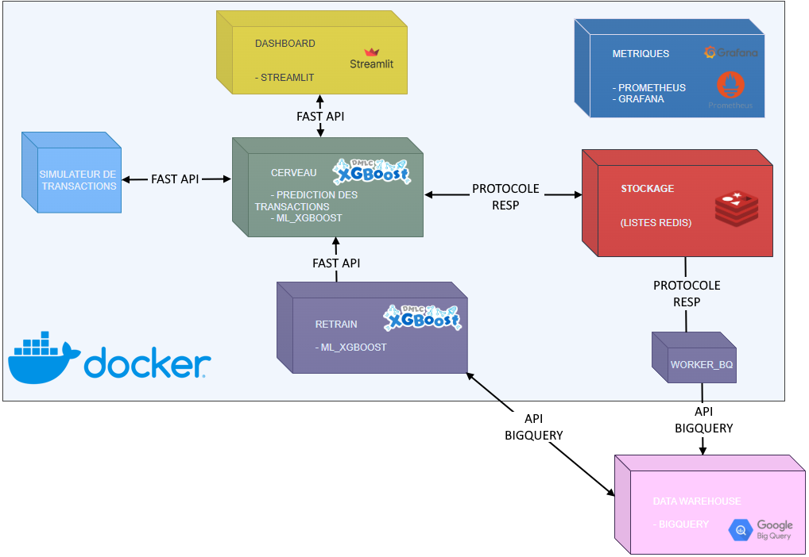

# 👋 Bonjour, moi c'est Frédéric Bayen !

 **Data Analyst en formation à la Wild Code School**

Expertise polyvalente alliant la **puissance des modèles prédictifs** (Machine Learning, NLP) à la **clarté des solutions de visualisation** (Dashboards, Reporting). Mon objectif est de transformer des données brutes en outils d'aide à la décision stratégiques et visuels.

---

## Projet majeur : [Système de détection de fraude en temps réel (MLOps)](https://github.com/BYRic-F/projet_fraude_cb)
*L'architecture la plus avancée de mon cursus : une solution end-to-end de détection et d'auto-apprentissage.*

### Réalisations Techniques
- [x] **Modèle XGBoost Haute Performance** : Recall de **0.87** sur un dataset critique (0.13% de fraudes).
- [x] **Architecture Temps Réel** : Ingestion asynchrone via **FastAPI** et bufferisation **Redis** pour une résilience maximale.
- [x] **Stack MLOps** : Orchestration complète du cycle de vie du modèle avec **Prefect** (ETL & Automation).
- [x] **Data Warehouse** : Archivage et requêtage massif sur **Google BigQuery**.
- [x] **Observabilité Totale** : Monitoring technique (**Grafana/Prometheus**) et pilotage métier (**Streamlit**).
- [x] **Conteneurisation** : Déploiement multi-services orchestré via **Docker Compose**.
- [x] **Auto-Retrain** : Pipeline de réentraînement automatique déclenché dynamiquement par le volume de données.

### Architecture du Pipeline

---

## Stack technique

### 1. Machine Learning & NLP

* **Systèmes de Recommandation :** Filtrage collaboratif et basé sur le contenu via **SVD** et **k-NN** (projet_reco_movie_streamlit).

* **Classification & Robustesse :** Expertise sur **XGBoost, Random Forest et Decision Trees**.

* **Traitement du déséquilibre :** Gestion des datasets asymétriques optimisation du Recall (projet_fraude_cb).

* **NLP :** Pré-traitement textuel complet (**Lemmatisation**, stop-words) et vectorisation via **TF-IDF.**

### 2. MLOps & Mise en Production

* **Orchestration de Workflows :** Automatisation des pipelines de données et de ré-entraînement avec **Prefect**.

* **Cycle de vie (Model Registry) :** Versioning et suivi des expérimentations avec MLflow.

* **Serving :** Déploiement de modèles via des API REST avec **FastAPI**.

* **Monitoring :** Monitoring technique et suivi des métriques en temps réel avec **Grafana**.

### 3. Python & Environnement

* **Gestion de projet :** Utilisation avancée de uv pour une gestion performante des dépendances et environnements.

* **Visualisation de données :** Création de graphiques complexes et analyses exploratoires avec **Matplotlib, Plotly-express et Seaborn**

* **Enrichissement de données :** Géocodage et manipulation de données via **API**.

* **Data Stack :** Maîtrise de **Pandas, NumPy, Streamlit, Scikit-Learn et DuckDb** pour le traitement de données volumineuses.

### 4. Engineering & Configuration

* **Conteneurisation :** Isolation des services et orchestration locale avec **Docker et Docker Compose**.

* **Versionnage :** Workflow Git collaboratif via **GitHub**.

* **IDE :** Optimisation du développement sous **VS Code**.

### 5. Business Intelligence & SQL

* **SQL Avancé :** Maîtrise des CTE, fonctions de fenêtrage et optimisation de requêtes **(MySQL, BigQuery)**.

* **Analytics Engineering :** Transformation de données et qualité avec **dbt et DuckDB**.

### 6. Modélisation & Dataviz

* **BI Interactive :** Conception de rapports Power BI basés sur un Schéma en étoile et calculs complexes en **DAX**.

### 7. IA Générative & LLMs (GenAI)

* **Intégration de Modèles :** Exploitation d'APIs de pointe (**Gemini**) pour le traitement de données non structurées.
* **Prompt Engineering :** Conception de prompts complexes et structurés pour la classification automatique (ex: mapping de codes NAF) et l'extraction d'entités.
* **Automatisation Intelligente :** Développement d'agents capables de transformer des requêtes métier en actions techniques (IA Prospector).

---

## Autres projets réalisés

### [IA Prospector — Solution d'enrichissement CRM](https://github.com/BYRic-F/Insee_prospector_cloud.git)

**Lien pour tester l'application :**

*Ce projet a été développé pour l'entreprise RH Performances afin d'automatiser l'extraction de prospects qualifiés via l'API Sirene.*

* **Intelligence Artificielle :** Utilisation de **Gemini 3.1 Flash** pour la classification NAF et l'enrichissement OSINT.
* **Précision Industrielle :** Filtrage dynamique par effectifs, état administratif et nomenclature NAF 2008.
* **UX/UI :** Interface de pilotage sous **Streamlit** avec exports CSV et monitoring des appels (liens `tel:`).

### [Système de recommandation de films](https://github.com/BYRic-F/project_reco_movie_streamlit.git)

**Lien pour tester l'application :**

* **Natural Language Processing (NLP) :** Traitement des métadonnées textuelles pour extraire les caractéristiques des films.
* **K-Nearest Neighbors (k-NN) :** Implémentation d'algorithmes de plus proches voisins pour la recommandation basée sur la similarité.
* **SVD (Singular Value Decomposition) :** Utilisation de la factorisation de matrice pour le filtrage collaboratif et la prédiction de préférences.
* **Stack :** Python, Scikit-Learn, Pandas, DuckDb.

### [Salifort Motors — HR Analytics (Python)](https://github.com/BYRic-F/salifort-motors-hr-analytics.git)
* **Objectif :** Prédire l'attrition des employés à l'aide de modèles Random Forest.
* **Analyse :** Identification des seuils de surcharge de travail (250h+/mois) et étude de l'impact de l'ancienneté sur les départs.

### [Toys & Models — Solution BI (SQL/Power BI)](https://github.com/BYRic-F/Toys_and_models.git)
* **Objectif :** Pilotage décisionnel à 360° pour les départements Ventes, Finances et RH.
* **Technique :** Transformation de données relationnelles en modèle analytique performant pour visualiser les KPIs critiques.

### [Bellabeat — Analyse de Santé (R)](https://github.com/BYRic-F/Bellabeat_case_study.git)
* **Objectif :** Étude des tendances d'activité de dispositifs intelligents pour orienter la stratégie marketing.
* **Outils :** Utilisation de RMarkdown pour générer des analyses basées sur la corrélation entre les pas et la dépense calorique.

---

## Parcours & certifications
* **Wild Code School :** Certification niveau 6 (Bac +3/4) obtenue en Mars 2026
* **Google Data Analytics :** Certification professionnelle obtenue.

---
📫 **Me contacter :** [www.linkedin.com/in/frédéric-bayen]
